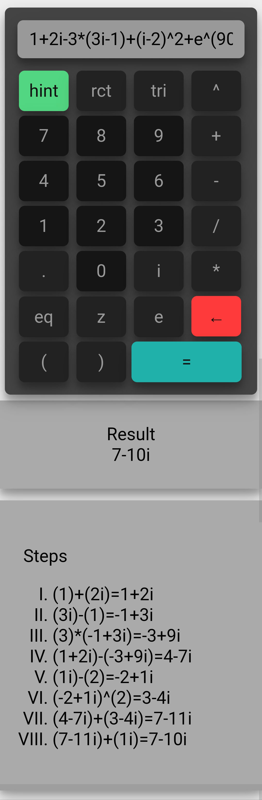
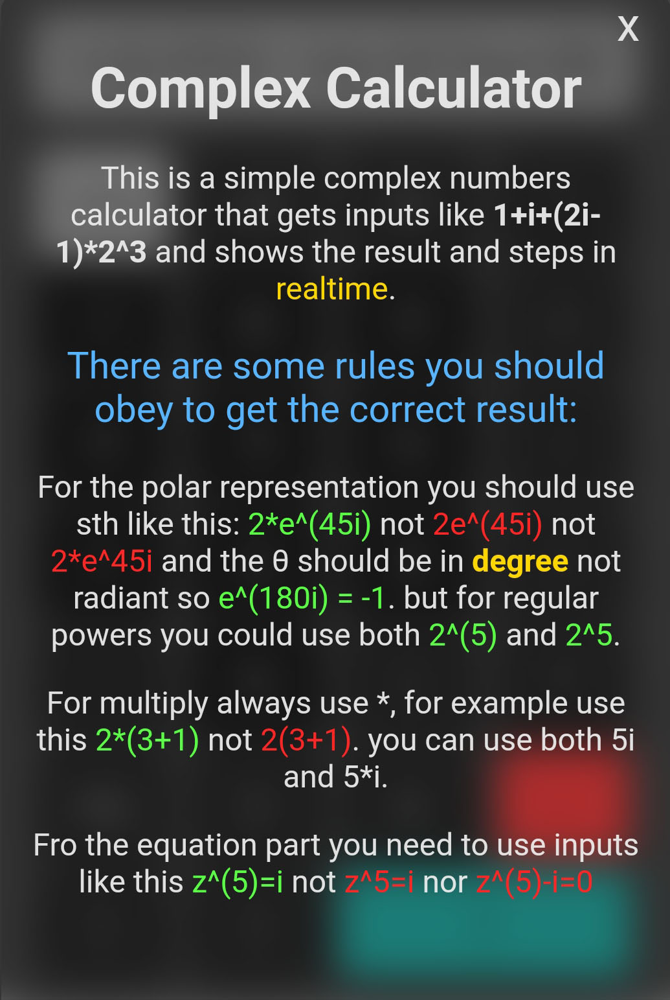

# Complex Calculator

This is my Engineering mathematics project, it's a complex number calculator and shows result in realtime. The θ is based on degree not radians so ( e^(180i)=-1 ).

It also solves simple equations like: z^(4)=1

and it shows z0=1, z1=-1, z2=i, z3=-1

<figure class="post-figure">

</figure>

<figure class="post-figure">

</figure>

It runs on https://erfanpaslar.ir/cc
